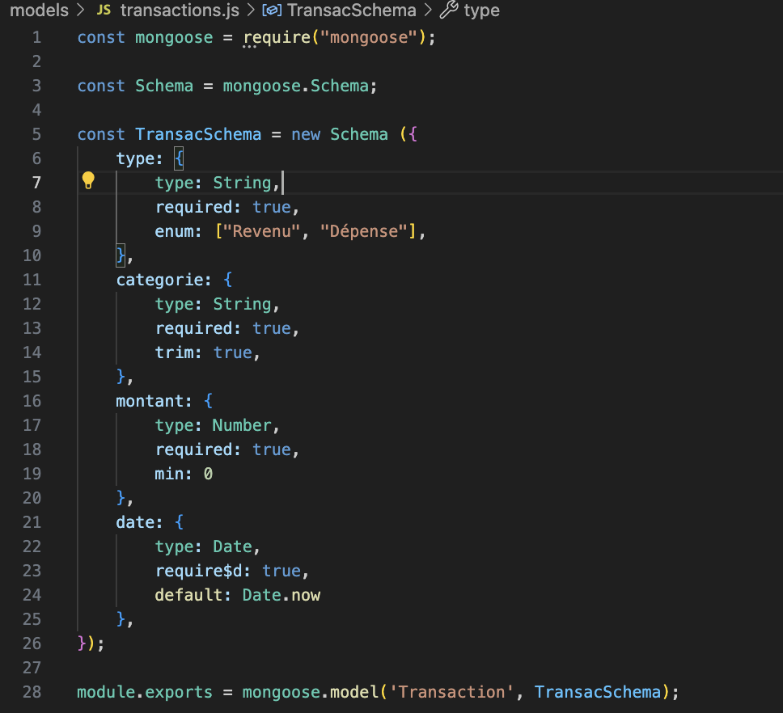
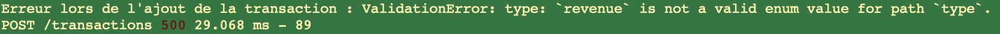
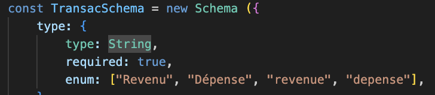
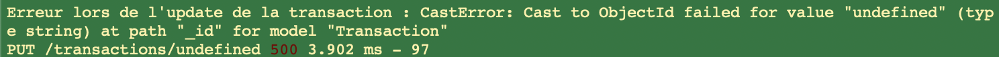
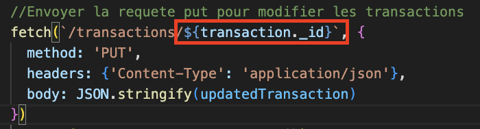
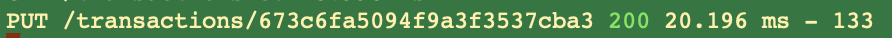

<h1>Documentation du projet SpendWise</h1>


## **1. Introduction**

**Présentation du projet :** SpendWise est une application de gestion des finances personnelles permettant aux utilisateurs de suivre et d’analyser leurs transactions financières (revenus et dépenses). L’application fournit des graphiques et des visualisations pour aider à la gestion des finances, en permettant aux utilisateurs de mieux comprendre où va leur argent.

**Contexte et objectifs :** Le projet a été conçu pour répondre à la problématique de la gestion financière personnelle (moi-même). Il permet aux utilisateurs d'ajouter des transactions, de les catégoriser, et de visualiser l'évolution de leurs finances grâce à des graphiques dynamiques.

------

## **2. Technologies et outils utilisés**

**Frontend :**

- **HTML** : Structure de la page web et des formulaires.
- **CSS** : Mise en forme et design de l'application.
- **JavaScript** : Logique côté client, gestion des événements et manipulation des DOM.
- **Chart.js** : Bibliothèque utilisée pour créer les graphiques (histogrammes et diagrammes circulaires).
- **LocalStorage** : Utilisé pour stocker les transactions de manière temporaire dans le navigateur de l'utilisateur (Lors des premièrs essaies)

**Backend :** (abandon du localstorage)

- **Node.js** : Environnement d'exécution côté serveur.
- **Express.js** : Framework pour construire les API RESTful.
- **MongoDB** : Base de données NoSQL utilisée pour stocker les transactions.
- **Mongoose** : Bibliothèque pour interagir avec MongoDB de manière simple et organisée.

**Dépendances installées :**

- **Cookie-parser : ** Permet de lire, analyser et manipuler les cookies envoyés par le client dans les requêtes HTTP.
- **morgan :**  Enregistre des informations sur chaque requête HTTP dans la console ou un fichier, utile pour le debugging et la surveillance.
- **path : **Assure la compatibilité des chemins entre différents systèmes d'exploitation
- **http-errors :** Génère facilement des erreurs avec des codes d'état HTTP (comme 404 ou 500) et des messages personnalisés.
- **debug : **une librairie pour gérer les logs de débogage dans les applications Node.js. Active ou désactive des logs par namespace.
- **moment.js :** Un outil facilitant la manipulation des dates et permet de formater de manière précise et plus simple que JavaScript "Vanilla"

**Outils de développement :**

- **Nodemon** : Utilisé pour recharger automatiquement l'application lors de modifications dans le code.
- **Eslint :** Un outil de développement analysant le code pour détecter les éventuelles erreurs et appliquer des règles de style. Dans l'objectif d'améliorer la qualité et la cohérence du code. 
- **Postman** : Outil pour tester les API RESTful et vérifier les routes du serveur.

**Ajout d'un script de démarrage `package.json` : **


<u>Explication</u> :

- `DEBUG=spendwise:*`  : On définit une variable d'environnement `DEBUG`qui active la journalisation des logs pour le namespace `spendwise:*` . Cela permet de filtrer et de montrer les logs uniquement pour ce namespace particulier (utile pour le débogage en développement).
- `npm run dev` : exécute le `nodemon app.js`. Un outil qui surveille les changements de fichiers dans le projet et redémarre automatiquement le serveur lorsque des modifications sont détectées. Pour une expérience de développement en continue, rapide et fluide sans avoir à redémarrer manuellement le serveur à chaque changement.


------

## **3. Architecture du projet**

Le projet se divise en deux principales parties :

1. **Frontend** (Côté client) : Contient l'interface utilisateur, les formulaires pour ajouter des transactions, et les pages de visualisation avec des graphiques.
2. **Backend** (Côté serveur) : Fournit une API RESTful pour gérer les transactions (ajout, suppression, modification, récupération). Les données sont stockées dans une base de données MongoDB.

### **Structure des fichiers :**

- `app.js` : Fichier principal qui lance l’application backend.

- `models/transactions.js` : Modèle Mongoose définissant la structure des transactions dans la base de données.

- `controllers/transactions.js` : Logique métier pour manipuler les transactions (CRUD).

- `routes/transactions.js` : Définition des routes pour chaque opération sur les transactions.

- `public/` : Contient les fichiers statiques (HTML, CSS, JS) pour l’interface utilisateur.

- `views/` : Si un moteur de template est utilisé, ce dossier peut contenir des fichiers de vue (ex. EJS, Pug). 

  > Note : pour le moment ce n'est pas le cas 

- `package.json` : Gestion des dépendances du projet et des scripts de démarrage.

------

## **4. Fonctionnalités principales**

### **a. Gestion des transactions :**

L’application permet à l’utilisateur de :

- Ajouter une transaction (revenu ou dépense).
- Supprimer une transaction.
- Modifier une transaction existante.
- Consulter toutes les transactions enregistrées.

### **b. Visualisation des transactions :**

L’application génère deux types de graphiques :

1. **Graphique des Revenus vs Dépenses** : Un graphique à barres permettant de comparer le total des revenus et des dépenses.
2. **Répartition des Dépenses** : Un graphique circulaire affichant la répartition des dépenses par catégorie.

------

## **5. Description technique**

<h3>Base de données : MongoDB</h3>

Commandes de démarrage : 

```bash
#Démarre le service 
brew services start mongodb-community@8.0
#Stopper le service : idem avec 
stop 
#Exécuter une requete : vérfier la version
db.version()
#vérifier si le service mongoDB a démarré 
brew services list 
#verifier si mongodb est en cours d'exécution 
ps aux | grep mongod
#Se connecter à MongoDB 
mongosh 
#Vérifier contenu bdd mongodb
show dbs 
use <ma_bdd>
show collections
db.maCollection.find() #Afficher le contenu d'une collection
```


### **Backend - Serveur Express :**

1. **Modèle de données (Mongoose) :** Le modèle `Transaction` est défini avec les attributs suivants :

   - **type** : Indique si la transaction est un revenu ou une dépense.
   - **categorie** : Catégorie de la transaction (ex. alimentation, loisirs, etc.).
   - **montant** : Montant de la transaction.
   - **date** : Date de la transaction, avec une valeur par défaut (date actuelle).

   

   Ajout d'un middleware pour formater la date avant l'enregistrement : 

   ```js
   //const TransacSchema 
   
   //Middleware formater date pré-enregistrement 
   TransacSchema.pre('save', function(next) {
       this.date = new Date(this.date.toISOString().split('T')[0]); // Garder uniquement la date (YYYY-MM-DD)
       next();
   });
   
   //module.exports
   ```

   

   

2. **Routes du serveur (Express)** : Les routes définissent les actions permettant de manipuler les transactions :

- **GET `/transactions`** : Récupérer toutes les transactions.
- **POST `/transactions`** : Ajouter une nouvelle transaction.
- **DELETE `/transactions/:id`** : Supprimer une transaction par son ID.
- **PUT `/transactions/:id`** : Modifier une transaction existante.

1. **Contrôleurs (Controllers)** : Les fonctions dans `controllers/transactions.js` permettent de gérer la logique métier pour chaque route :

- `getAllTransactions`: Récupérer toutes les transactions de la base de données.
- `addTransaction`: Ajouter une nouvelle transaction dans la base de données.
- `deleteTransaction`: Supprimer une transaction par ID.
- `updateTransaction`: Mettre à jour une transaction existante.

### **Frontend - Pages HTML** :

- **Ajout de transactions** : Formulaire permettant à l’utilisateur de saisir une nouvelle transaction.
- **Visualisation** : Graphiques générés avec Chart.js pour visualiser les dépenses et revenus.

------

## **6. Instructions d'installation et de déploiement**

1. **Cloner le projet :**

   ```bash
   git clone <url_du_projet>
   ```

2. **Installer les dépendances :** Dans le dossier du projet, exécuter la commande suivante pour installer toutes les dépendances nécessaires du projet :

   ```bash
   npm install
   ```

3. **Lancer le serveur en mode développement** :

   ```bash
   npm run dev
   ```

4. **Accéder à l'application :** Ouvrir un navigateur et naviguer vers http://localhost:3000 pour accéder à l'application.

## **7. Diagrammes et Schémas**

**a. Diagramme de base de données (modèle Mongoose)** : Un diagramme UML ou une simple table peut être utilisé pour visualiser la structure de la base de données. Par exemple, un diagramme montrant le modèle `Transaction` avec les champs `type`, `categorie`, `montant`, et `date`.

**b. Diagrammes de flux d'interaction :** Des diagrammes montrant les interactions entre le client (frontend) et le serveur (API backend), ainsi que la gestion des requêtes HTTP, peuvent aider à comprendre l'architecture du projet.


## **8. Tests et Débogage**

### **a. Tests manuels**

Les tests manuels ont été effectués pour vérifier le bon fonctionnement des fonctionnalités principales de l’application, notamment :

- Ajouter, modifier, et supprimer des transactions.
- Vérifier la validité des graphiques (revenus et dépenses).

### **b. Tests unitaires** (à voir)

À mentionner 


## **9. Problémes rencontrés**

1. **Erreur lors de la saisie de la transaction : **

   Source du problème : l'option `enum` dans le fichier `models/transactions` ne reconnaissait pas le type "revenue" comme valeur :

   

   > Note : <span style="color: red;">**Importance**</span> de bien configurer le code pour afficher les erreurs 
   >
   > 

   Solution : j'ai élargi les valeurs acceptées par `enum` 

   

   > Note : j'ai modifié la valeur "revenue" en "revenu" pour correspondre à l'ortographe française 

2. **Erreur lors de la modification et suppression : **

   $Source : l'`id` de la transaction n'est pas défini. Il est possible que j'ai mal configurer la requête PUT. 

   J'ai constaté que sous MongoDB, l'`id`  est stocké sous le nom `_id`. Or dans mon fichier je les mis sous cette forme `.id` .

   

   Cette erreur impactait également l'affichage du total des revenus au niveau du diagramme en barres pour la visualisation.

   Solution : J'ai simplement changé la forme de l'id en `_id` 

   

   Résultat : 

   PUT request ? OK

   

   DELETE request? OK

   

3. **Formater la date sans la timezone ni l'heure :**

   

4. Autre

## **10. Conclusion et perspectives**

Ce projet offre une solution simple et intuitive pour la gestion des finances personnelles, avec une interface utilisateur graphique et une API backend bien structurée. Ce projet est, de base, à but personnel. Mais à l'avenir, des améliorations pour étendre son cas d'utilisation est possibles incluant :

- Ajout de comptes utilisateurs
- Ajouter une authentification pour gérer des comptes utilisateurs.
- Permettre la gestion des catégories de dépenses et leur personnalisation.
- Implémenter des rapports plus détaillés sur les finances.
- Intégrer une simulation de budget 
- Etc